# Permissions

Place an `X` in the appropriate bracket below to specify if you would like your group's project to be made available to the public. (Note that student names will be included (but PIDs will be scraped from any groups who include their PIDs).

* [ X ] YES - make available
* [  ] NO - keep private

# Names

- Haoyu Fu
- Qianxia Hui
- Arianna Morris
- Michael Tang
- Bofu Zou

# Overview

This study embarked on a mission to unravel the connection between parking occupancy and traffic collisions around a college campus, offering fresh perspectives for student safety and urban infrastructure. Motivated by prior research linking traffic incidents to geographic regions, we harnessed data analysis to craft a narrative relevant to our student community and beyond. By meticulously merging parking and collision datasets, we employed linear regression and Welch's t-test, revealing a statistically significant but slight positive correlation: as parking lots near capacity, the likelihood of collisions incrementally increases. The findings from our robust statistical approach suggest that parking management plays a more critical role in campus safety than previously recognized. These insights provide a springboard for data-driven policy making, potentially leading to enhanced traffic safety measures on college campuses.


# Research Question

Does parking occupancy on UCSD's campus predict collisions on major roads near UCSD's campus?

## Background and Prior Work

Traffic incidents are always a significant concern in modern cities, especially in densely populated areas. As a large institution with a growing population, the University of California, San Diego (UCSD) campus tackles the problems brought by heavy vehicular traffic and parking. As the campus community grows, the parking occupancy rates may reflect the number of traffic incidents happening around the campus area. Our study seeks to find out whether there’s a correlation between the UCSD campus parking occupancy rates and the traffic incidents happening surrounding campus. 

While our topic is mainly focused on how parking occupancy may predict the occurrence of traffic collisions within the area of UCSD, there have been prior studies that analyze the likelihood of car accidents occurring in a given geographic region. For example, Forbes Advisor compiled a list of the top 50 U.S. cities with the highest likelihood of getting into a car accident, with San Diego being one of them.<a name="cite_ref-1"></a>[<sup>1</sup>](#cite_note-1) This ranking system was determined by data for fatality rate per 100,000 people from the National Highway Transportation Safety Administration and average years between collisions and relative collision likelihood from the AllState Best Drivers Index. This data analysis only focuses on urban cities, which means the dataset is relatively small as only the 50 largest cities by population from census data were chosen. A general understanding of a particular city's collision danger is approximated by comparison to other major cities in the dataset. Forbes Advisor’s primary goal is providing financial advice, which this data analysis does by offering relevant information about collisions that may involve insurance, lawyer/attorney, and risk assessment situations. 

Another study investigated the causal relationship between road density and parking occupancy.<a name="cite_ref-2"></a>[<sup>2</sup>](#cite_note-2) Tunisian researchers conducted a research paper to investigate the causal relationship between road density and parking occupancy in Tunis city center using Granger causality tests based on vector error correction modeling. The authors collected data using video cameras around a major street in the capital of Tunis, and found that there does exist a causal relationship between road density and parking occupancy, with road density Granger-causing parking occupancy. This suggests that increasing road density may lead to an increase in parking occupancy, which in turn may lead to an increase in road congestion. The authors suggest that their findings can be used to develop more sustainable parking policies that reduce road congestion and can be incorporated into parking models to improve their accuracy and effectiveness. This study provides important insights into the relationship between road density and parking occupancy, and gives us some ideas for our own project since road density and traffic incidents are two significant features of a city’s traffic conditions.

Similarly, we want to assess what the general level of safety associated with traffic collisions might be through exploring a more confined geographical area that is of interest to us, UCSD. Based upon these prior works and the UCSD campus parking occupancy and nearby traffic incidence data, our project aims to identify patterns specific to UCSD campus and its surrounding areas. We will conduct a descriptive and exploratory data analysis of these datasets, which will allow us to identify important features of the datasets and how they may relate to one another. We aim to contribute to the existing literature on road safety and how it impacts us on the UCSD campus. 

**References:**

1. <a name="cite_note-1"></a> [^](#cite_ref-1) Christy Bieber, J. D. (2023, October 25). The cities where you’re most likely to get in a car accident. Forbes. https://www.forbes.com/advisor/legal/auto-accident/cities-most-car-accidents/  
2. <a name="cite_note-2"></a> [^](#cite_ref-2) Hassine, S. B., Kooli, E., & Mraihi, R. (2022). The causal relationship between road density and parking occupancy. World Journal of Advanced Research and Reviews, 15(3), 125–134. https://wjarr.com/sites/default/files/WJARR-2022-0896.pdf


# Hypothesis


We hypothesize that there will be a positive correlation between the number of cars parked on campus (`percent_occupied`) and the amount of collisions (`collision_data`) occurring on and around the UCSD campus. We believe this because more congestion within the campus area could lead to more traffic incidents occurring.

# Data

## Data overview

- Dataset #1
  - Dataset Name: Survey of Parking Space Occupancy Levels
  - Link to the dataset: https://rmp-wapps.ucsd.edu/TS/Survey/Survey%20of%20Parking%20Space%20Occupancy%20Levels/Quarterly%20Tables/Contents.html 
  - Number of observations: 93 (quarterly tables)
  - Number of variables: 15 ("University-Wide" data)

There are a total 93 observations in this dataset, with each consisting of the parking occupancy levels of UCSD parking lots of a given quarter at UCSD, from Summer 2000 to Summer 2023. However, we only plan to utilize 29 of the observations, from Summer 2016 to Summer 2023, to stay consistent with the data we have in Dataset #2. We started by scraping the dataset link for the 29 observations we wanted, and combined those 29 observations into one csv file (QbyQ UCSD Parking Occupancy.csv) to make our data analysis easier. For each row (observation) in our csv file, we have 15 columns (variables) which covers information including parking spaces in total, empty parking spaces listed in hourly time, and occupancy proportion at peak time (important feature that could be utilized along with another dataset). The variables all have the same datatype: numerical variables. After creating our own csv file from the weblink, we have a dataset we integrated ourselves, so we didn't need to do much data cleaning. Since we weren't interested in the columns that display parking occupancy in hourly time, we dropped those columns from the dataset.

- Dataset #2
  - Dataset Name: Traffic collisions details (2015 through year-to-date)
  - Link to the dataset: https://data.sandiego.gov/datasets/police-collisions-details/
  - Number of observations: 123,708
  - Number of variables: 22

This dataset encompasses traffic collision details in the San Diego area (including the vicinity of UCSD) from 2015 to the present, with a total of 123,708 observations and 22 variables. The important variables in the dataset include time stamp of the collision, location details, violation type,  number of injuries and fatalities. The data types include categorical variables (violation type), numerical variables (number of injuries and fatalities), and time variables. The dataset can serve as a proxy for understanding traffic conditions and traffic safety in the area. We needed to clean the dataset by filtering location (street names) in the dataset to find collisions that happen on the major streets in UCSD surrounding area. Then we handled missing values, converting data type, and removing irrelevant variables. Additionally, we transformed the ISO 8601 formatted dates into dates that fit into our quarter-by-quarter analysis according to UCSD's quarter dates for the 2016-2023 school years. We then dropped the date_time columns and added our own column with the quarter-formatted dates. We also had to drop rows containing data for the Fall 2023 quarter, as it is still ongoing and it wouldn't make sense to make an analysis on this data.

## Dataset #1: Quarter by Quarter UCSD Parking Occupancy Dataset


```python
import pandas as pd
import seaborn as sns
import matplotlib.pyplot as plt
import numpy as np

import patsy
import statsmodels.api as sm
import scipy.stats as stats
```


```python
## Import csv file with parking data
parking_data = pd.read_csv('QbyQ UCSD Parking Occupancy.csv', 
                            usecols = ['Quarter', 'Year', 'Parking Spaces', 
                                    'Empty Spaces', 'Occupied Spaces', '% Occupied'])

## Rename the column names
parking_data = parking_data.rename(columns={'Quarter':'quarter', 'Year':'year', 
                     'Parking Spaces':'parking_spaces', 'Empty Spaces':'empty_spaces', 
                     'Occupied Spaces':'occupied_spaces', '% Occupied':'percent_occupied'})
parking_data
```


<div>
<style scoped>
    .dataframe tbody tr th:only-of-type {
        vertical-align: middle;
    }

    .dataframe tbody tr th {
        vertical-align: top;
    }

    .dataframe thead th {
        text-align: right;
    }
</style>
<table border="1" class="dataframe">
  <thead>
    <tr style="text-align: right;">
      <th></th>
      <th>quarter</th>
      <th>year</th>
      <th>parking_spaces</th>
      <th>empty_spaces</th>
      <th>occupied_spaces</th>
      <th>percent_occupied</th>
    </tr>
  </thead>
  <tbody>
    <tr>
      <th>0</th>
      <td>Summer</td>
      <td>2016</td>
      <td>19297</td>
      <td>6567</td>
      <td>12730</td>
      <td>65.97%</td>
    </tr>
    <tr>
      <th>1</th>
      <td>Fall</td>
      <td>2016</td>
      <td>19245</td>
      <td>3578</td>
      <td>15667</td>
      <td>81.41%</td>
    </tr>
    <tr>
      <th>2</th>
      <td>Winter</td>
      <td>2017</td>
      <td>18316</td>
      <td>2691</td>
      <td>15625</td>
      <td>85.31%</td>
    </tr>
    <tr>
      <th>3</th>
      <td>Spring</td>
      <td>2017</td>
      <td>18334</td>
      <td>3096</td>
      <td>15238</td>
      <td>83.11%</td>
    </tr>
    <tr>
      <th>4</th>
      <td>Summer</td>
      <td>2017</td>
      <td>18082</td>
      <td>5050</td>
      <td>13032</td>
      <td>72.07%</td>
    </tr>
    <tr>
      <th>5</th>
      <td>Fall</td>
      <td>2017</td>
      <td>18011</td>
      <td>2313</td>
      <td>15698</td>
      <td>87.16%</td>
    </tr>
    <tr>
      <th>6</th>
      <td>Winter</td>
      <td>2018</td>
      <td>18105</td>
      <td>2385</td>
      <td>15720</td>
      <td>86.83%</td>
    </tr>
    <tr>
      <th>7</th>
      <td>Spring</td>
      <td>2018</td>
      <td>18092</td>
      <td>2504</td>
      <td>15588</td>
      <td>86.16%</td>
    </tr>
    <tr>
      <th>8</th>
      <td>Summer</td>
      <td>2018</td>
      <td>17107</td>
      <td>4466</td>
      <td>12641</td>
      <td>74.00%</td>
    </tr>
    <tr>
      <th>9</th>
      <td>Fall</td>
      <td>2018</td>
      <td>17408</td>
      <td>3052</td>
      <td>14356</td>
      <td>82.47%</td>
    </tr>
    <tr>
      <th>10</th>
      <td>Winter</td>
      <td>2019</td>
      <td>18643</td>
      <td>2769</td>
      <td>15874</td>
      <td>85.00%</td>
    </tr>
    <tr>
      <th>11</th>
      <td>Spring</td>
      <td>2019</td>
      <td>18660</td>
      <td>2936</td>
      <td>15724</td>
      <td>84.27%</td>
    </tr>
    <tr>
      <th>12</th>
      <td>Summer</td>
      <td>2019</td>
      <td>18400</td>
      <td>4024</td>
      <td>14376</td>
      <td>78.00%</td>
    </tr>
    <tr>
      <th>13</th>
      <td>Fall</td>
      <td>2019</td>
      <td>19381</td>
      <td>3749</td>
      <td>15632</td>
      <td>80.66%</td>
    </tr>
    <tr>
      <th>14</th>
      <td>Winter</td>
      <td>2020</td>
      <td>18324</td>
      <td>1721</td>
      <td>16603</td>
      <td>90.61%</td>
    </tr>
    <tr>
      <th>15</th>
      <td>Spring</td>
      <td>2020</td>
      <td>18608</td>
      <td>11275</td>
      <td>7333</td>
      <td>39.41%</td>
    </tr>
    <tr>
      <th>16</th>
      <td>Summer</td>
      <td>2020</td>
      <td>18495</td>
      <td>10274</td>
      <td>8221</td>
      <td>44.45%</td>
    </tr>
    <tr>
      <th>17</th>
      <td>Fall</td>
      <td>2020</td>
      <td>18066</td>
      <td>9149</td>
      <td>8917</td>
      <td>49.36%</td>
    </tr>
    <tr>
      <th>18</th>
      <td>Winter</td>
      <td>2021</td>
      <td>18132</td>
      <td>7418</td>
      <td>10714</td>
      <td>59.09%</td>
    </tr>
    <tr>
      <th>19</th>
      <td>Spring</td>
      <td>2021</td>
      <td>18157</td>
      <td>6775</td>
      <td>11382</td>
      <td>62.69%</td>
    </tr>
    <tr>
      <th>20</th>
      <td>Summer</td>
      <td>2021</td>
      <td>17933</td>
      <td>7553</td>
      <td>10380</td>
      <td>58.00%</td>
    </tr>
    <tr>
      <th>21</th>
      <td>Fall</td>
      <td>2021</td>
      <td>18248</td>
      <td>5784</td>
      <td>12464</td>
      <td>68.30%</td>
    </tr>
    <tr>
      <th>22</th>
      <td>Winter</td>
      <td>2022</td>
      <td>18351</td>
      <td>6200</td>
      <td>12151</td>
      <td>66.21%</td>
    </tr>
    <tr>
      <th>23</th>
      <td>Spring</td>
      <td>2022</td>
      <td>18478</td>
      <td>3700</td>
      <td>14778</td>
      <td>79.98%</td>
    </tr>
    <tr>
      <th>24</th>
      <td>Summer</td>
      <td>2022</td>
      <td>18726</td>
      <td>7558</td>
      <td>11168</td>
      <td>60.00%</td>
    </tr>
    <tr>
      <th>25</th>
      <td>Fall</td>
      <td>2022</td>
      <td>18652</td>
      <td>3870</td>
      <td>14782</td>
      <td>79.25%</td>
    </tr>
    <tr>
      <th>26</th>
      <td>Winter</td>
      <td>2023</td>
      <td>18926</td>
      <td>3903</td>
      <td>15023</td>
      <td>79.00%</td>
    </tr>
    <tr>
      <th>27</th>
      <td>Spring</td>
      <td>2023</td>
      <td>18739</td>
      <td>3462</td>
      <td>15277</td>
      <td>82.00%</td>
    </tr>
    <tr>
      <th>28</th>
      <td>Summer</td>
      <td>2023</td>
      <td>18352</td>
      <td>5685</td>
      <td>12667</td>
      <td>69.02%</td>
    </tr>
  </tbody>
</table>
</div>


## Dataset #2: San Diego PD Traffic Collision Details Dataset


```python
## Import csv file with collision data
collision_data = pd.read_csv('https://seshat.datasd.org/traffic_collision_details/pd_collisions_details_datasd.csv', usecols = ['date_time', 'address_road_primary', 'injured', 'killed'], parse_dates = ['date_time'])
collision_data.head()
```


<div>
<style scoped>
    .dataframe tbody tr th:only-of-type {
        vertical-align: middle;
    }

    .dataframe tbody tr th {
        vertical-align: top;
    }

    .dataframe thead th {
        text-align: right;
    }
</style>
<table border="1" class="dataframe">
  <thead>
    <tr style="text-align: right;">
      <th></th>
      <th>date_time</th>
      <th>address_road_primary</th>
      <th>injured</th>
      <th>killed</th>
    </tr>
  </thead>
  <tbody>
    <tr>
      <th>0</th>
      <td>2015-01-14 20:00:00</td>
      <td>JUNIPER</td>
      <td>0</td>
      <td>0</td>
    </tr>
    <tr>
      <th>1</th>
      <td>2015-03-19 12:00:00</td>
      <td>LINDA VISTA</td>
      <td>0</td>
      <td>0</td>
    </tr>
    <tr>
      <th>2</th>
      <td>2015-03-24 03:05:00</td>
      <td>WASHINGTON</td>
      <td>2</td>
      <td>0</td>
    </tr>
    <tr>
      <th>3</th>
      <td>2015-03-27 23:56:00</td>
      <td>WORDEN</td>
      <td>1</td>
      <td>0</td>
    </tr>
    <tr>
      <th>4</th>
      <td>2015-07-06 11:45:00</td>
      <td>EL CAJON</td>
      <td>0</td>
      <td>0</td>
    </tr>
  </tbody>
</table>
</div>


```python
## Filter datasset to include only relevant street names for analysis
collision_data['address_road_primary'] = collision_data['address_road_primary'].apply(lambda x: str.lower(str(x)))
street_names = ['genesee', 'gilman', 'hopkins', 'la jolla farms', 
                'la jolla scenic', 'la jolla scenic dr north', 
                'la jolla scenic n', 'la jolla village', 'lebon', 
                'nobel', 'north torrey pines', 'regents', 
                'villa la jolla', 'voigt']
collision_data = collision_data[collision_data['address_road_primary'].isin(street_names)]
collision_data
```


<div>
<style scoped>
    .dataframe tbody tr th:only-of-type {
        vertical-align: middle;
    }

    .dataframe tbody tr th {
        vertical-align: top;
    }

    .dataframe thead th {
        text-align: right;
    }
</style>
<table border="1" class="dataframe">
  <thead>
    <tr style="text-align: right;">
      <th></th>
      <th>date_time</th>
      <th>address_road_primary</th>
      <th>injured</th>
      <th>killed</th>
    </tr>
  </thead>
  <tbody>
    <tr>
      <th>50</th>
      <td>2016-07-06 00:01:00</td>
      <td>la jolla village</td>
      <td>0</td>
      <td>0</td>
    </tr>
    <tr>
      <th>87</th>
      <td>2016-07-29 15:27:00</td>
      <td>genesee</td>
      <td>0</td>
      <td>0</td>
    </tr>
    <tr>
      <th>88</th>
      <td>2016-07-29 15:27:00</td>
      <td>genesee</td>
      <td>0</td>
      <td>0</td>
    </tr>
    <tr>
      <th>134</th>
      <td>2016-08-05 07:30:00</td>
      <td>nobel</td>
      <td>1</td>
      <td>0</td>
    </tr>
    <tr>
      <th>149</th>
      <td>2016-08-06 20:39:00</td>
      <td>nobel</td>
      <td>1</td>
      <td>0</td>
    </tr>
    <tr>
      <th>...</th>
      <td>...</td>
      <td>...</td>
      <td>...</td>
      <td>...</td>
    </tr>
    <tr>
      <th>125608</th>
      <td>2022-08-06 18:47:00</td>
      <td>genesee</td>
      <td>1</td>
      <td>0</td>
    </tr>
    <tr>
      <th>125653</th>
      <td>2023-01-13 20:56:00</td>
      <td>regents</td>
      <td>0</td>
      <td>0</td>
    </tr>
    <tr>
      <th>125656</th>
      <td>2023-01-22 12:19:00</td>
      <td>genesee</td>
      <td>1</td>
      <td>0</td>
    </tr>
    <tr>
      <th>125740</th>
      <td>2023-10-28 23:18:00</td>
      <td>genesee</td>
      <td>0</td>
      <td>0</td>
    </tr>
    <tr>
      <th>125741</th>
      <td>2023-11-05 14:50:46</td>
      <td>north torrey pines</td>
      <td>0</td>
      <td>0</td>
    </tr>
  </tbody>
</table>
<p>3198 rows × 4 columns</p>
</div>


```python
# Extract the year for collision_data
collision_data['date_time'] = pd.to_datetime(collision_data['date_time'])
collision_data["year"] = collision_data['date_time'].dt.year
collision_data.dtypes

# Extract the quarter time from UCSD_Quarter_Dates
quarter_dates = pd.read_csv("UCSD_Quarter_Dates.csv")
quarter_dates["Start_date"] = pd.to_datetime(quarter_dates['Start'])
quarter_dates["End_date"] = pd.to_datetime(quarter_dates['End'])

def quarter_check(date):
    for row in quarter_dates.values:
        if date >= row[3] and date <= row[4] + pd.Timedelta(days=1):
            return row[0]
    return None

# Extract the quarter for collision_data
collision_data["quarter"] = collision_data["date_time"].apply(quarter_check)
collision_data = collision_data.dropna(subset=["quarter"])
collision_data = collision_data[["year", "quarter", "address_road_primary", "injured", "killed"]]
collision_data = collision_data.drop(collision_data[(collision_data['quarter'] == 'Fall') & (collision_data['year'] == 2023)].index)

collision_data
```


<div>
<style scoped>
    .dataframe tbody tr th:only-of-type {
        vertical-align: middle;
    }

    .dataframe tbody tr th {
        vertical-align: top;
    }

    .dataframe thead th {
        text-align: right;
    }
</style>
<table border="1" class="dataframe">
  <thead>
    <tr style="text-align: right;">
      <th></th>
      <th>year</th>
      <th>quarter</th>
      <th>address_road_primary</th>
      <th>injured</th>
      <th>killed</th>
    </tr>
  </thead>
  <tbody>
    <tr>
      <th>50</th>
      <td>2016</td>
      <td>Summer</td>
      <td>la jolla village</td>
      <td>0</td>
      <td>0</td>
    </tr>
    <tr>
      <th>87</th>
      <td>2016</td>
      <td>Summer</td>
      <td>genesee</td>
      <td>0</td>
      <td>0</td>
    </tr>
    <tr>
      <th>88</th>
      <td>2016</td>
      <td>Summer</td>
      <td>genesee</td>
      <td>0</td>
      <td>0</td>
    </tr>
    <tr>
      <th>134</th>
      <td>2016</td>
      <td>Summer</td>
      <td>nobel</td>
      <td>1</td>
      <td>0</td>
    </tr>
    <tr>
      <th>149</th>
      <td>2016</td>
      <td>Summer</td>
      <td>nobel</td>
      <td>1</td>
      <td>0</td>
    </tr>
    <tr>
      <th>...</th>
      <td>...</td>
      <td>...</td>
      <td>...</td>
      <td>...</td>
      <td>...</td>
    </tr>
    <tr>
      <th>125491</th>
      <td>2021</td>
      <td>Fall</td>
      <td>nobel</td>
      <td>1</td>
      <td>0</td>
    </tr>
    <tr>
      <th>125505</th>
      <td>2021</td>
      <td>Fall</td>
      <td>regents</td>
      <td>1</td>
      <td>0</td>
    </tr>
    <tr>
      <th>125608</th>
      <td>2022</td>
      <td>Summer</td>
      <td>genesee</td>
      <td>1</td>
      <td>0</td>
    </tr>
    <tr>
      <th>125653</th>
      <td>2023</td>
      <td>Winter</td>
      <td>regents</td>
      <td>0</td>
      <td>0</td>
    </tr>
    <tr>
      <th>125656</th>
      <td>2023</td>
      <td>Winter</td>
      <td>genesee</td>
      <td>1</td>
      <td>0</td>
    </tr>
  </tbody>
</table>
<p>3114 rows × 5 columns</p>
</div>


# Results

## Exploratory Data Analysis

#### First we will conduct an analysis of the datasets seperately to obtain a greater understanding of their contents, then we will analyze them together. 

### Dataset 1: `percent_occupied` parking spaces per `quarter`

We will generate summary statistics regarding `percent_occupied` spots by `quarter` and `year` on the UCSD campus. This will help us to first understand the basics of our data.


```python
# remove percentage signs from column 
parking_data['percent_occupied'] = parking_data['percent_occupied'].str.replace('%', '')

# convert to float values
parking_data['percent_occupied'] = pd.to_numeric(parking_data['percent_occupied'])
```


```python
parking_data['percent_occupied'].describe()
```


    count    29.000000
    mean     73.096207
    std      13.601178
    min      39.410000
    25%      65.970000
    50%      79.000000
    75%      83.110000
    max      90.610000
    Name: percent_occupied, dtype: float64


Based upon these statistics, we can see that we have data for 29 `quarter`s, wherein the average `percent_occupied` falls at 73%. The minimum value for `percent_occupied` is 39% occupied, and the maximum is 90%. Next, we will generate a barplot that will allow us to visualize any outliers in the data, or any trends within the data that we may not see within the summary statistics. 


```python
# make copy of DF
occupied = parking_data.copy()

# concat quarter and year columns 
occupied['quarter_year'] = occupied['quarter'].str.cat(occupied['year'].astype(str), sep = ' ')

# create plot w labels using dodge to set hue of bars to year without adjusting bar width
sns.barplot(data=occupied, x='percent_occupied', y='quarter_year', hue='year', dodge=False)
plt.title('Percentage of Occupied Parking Spots by Quarter and Year')
plt.xlabel('Percent Occupied')
plt.ylabel('Quarter and Year')
plt.show()
```


    
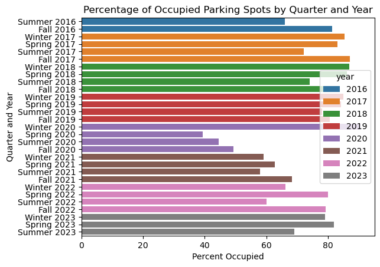
    


We can see based upon this figure that while `percent_occupied` remains relatively stable between 60%-80% occupied in accordance with the mean value of 73% occupied, in the spring 2020 `quarter`, there begins a significant dip in occupancy, where our minimum value (39% occupancy) occurs. This is likely due to the switch to online learning that occured during this time. As on campus activities resume, `percent_occupied` slowly returns to values between 60%-80% again. 

### Dataset 1: `percent_occupied` and `parking_spaces` per `quarter` (grouped)

In order to understand the potential relationship between `percent_occupied` and the total number of available `parking_spaces` on campus, we will generate a boxplot that shows the values of each, averaged over each `quarter` from 2016-2023. 


```python
parking_data['parking_spaces'] = parking_data['parking_spaces'].astype('int')
sns.set(font_scale=1, style="white")
fig, ax = plt.subplots(1, 2, sharex=False, sharey=False)
plt.subplots_adjust(wspace=0.5)
sns.boxplot(ax=ax[0], data=parking_data, x='quarter', y='percent_occupied')
sns.boxplot(ax=ax[1], data=parking_data, x='quarter', y='parking_spaces');
```


    
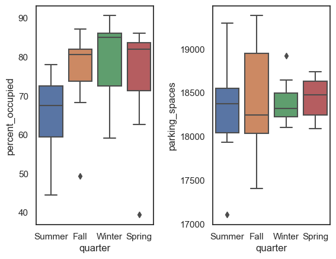
    


We notice that summer `quarter` has the lowest `percent_occupied`. It appears highest in the Winter and lowest in the Summer, suggesting a seasonal effect on `percent_occupied`. 
There are two outliers, one in Fall and the other in Spring `quarter` due to the campus close that occurred during the COVID-19 pandemic.  

### Dataset 2: Number of collisions in `collision_data` per `quarter`

First, we check how many collisions occurred each `quarter` using ```groupby```.


```python
collision_data.groupby(['quarter', 'year']).size().reset_index(name='Count')

collision_data.head()
```


<div>
<style scoped>
    .dataframe tbody tr th:only-of-type {
        vertical-align: middle;
    }

    .dataframe tbody tr th {
        vertical-align: top;
    }

    .dataframe thead th {
        text-align: right;
    }
</style>
<table border="1" class="dataframe">
  <thead>
    <tr style="text-align: right;">
      <th></th>
      <th>year</th>
      <th>quarter</th>
      <th>address_road_primary</th>
      <th>injured</th>
      <th>killed</th>
    </tr>
  </thead>
  <tbody>
    <tr>
      <th>50</th>
      <td>2016</td>
      <td>Summer</td>
      <td>la jolla village</td>
      <td>0</td>
      <td>0</td>
    </tr>
    <tr>
      <th>87</th>
      <td>2016</td>
      <td>Summer</td>
      <td>genesee</td>
      <td>0</td>
      <td>0</td>
    </tr>
    <tr>
      <th>88</th>
      <td>2016</td>
      <td>Summer</td>
      <td>genesee</td>
      <td>0</td>
      <td>0</td>
    </tr>
    <tr>
      <th>134</th>
      <td>2016</td>
      <td>Summer</td>
      <td>nobel</td>
      <td>1</td>
      <td>0</td>
    </tr>
    <tr>
      <th>149</th>
      <td>2016</td>
      <td>Summer</td>
      <td>nobel</td>
      <td>1</td>
      <td>0</td>
    </tr>
  </tbody>
</table>
</div>


```python
min = collision_data.groupby(['quarter', 'year']).size().min()
median = collision_data.groupby(['quarter', 'year']).size().median()
max = collision_data.groupby(['quarter', 'year']).size().max()
min, median, max
```


    (54, 101.0, 175)


We can find that the minimum number of collisions is 54, the median number of collisions is 101, and the maximum number of collisions is 175 (all per quarter).


```python
sns.set(font_scale=2, style="white")

plt.figure(figsize=(8, 4))
sns.histplot(data = collision_data, x = collision_data.groupby(['quarter', 'year']).size(), bins = 35)
plt.ylabel('Number of quarters')  
plt.xlabel('Number of collisions')
plt.show()
```


    
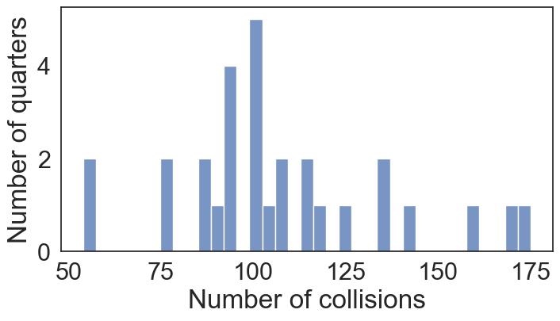
    


The `collision_data` that we grouped can be plotted in a histogram to see a general range of the total number of collisions that occur in a `quarter`. This helps us visualize that the minimum number of collisions is roughly 50, and the maximum number of collisions is roughly 175. There aren't any extreme outliers in the data, as the data is relatively normally distributed with a slight left skew.

### Dataset 2: Number of collisions in `collision_data` per `address_road_primary`


Within dataset 2, the street name on which the collision occurred is stored in the column titled `address_road_primary`. Thus, we will count the number of collisions that occur on each street.


```python
collision_data.groupby(["address_road_primary"]).size().reset_index(name='Count')
```


<div>
<style scoped>
    .dataframe tbody tr th:only-of-type {
        vertical-align: middle;
    }

    .dataframe tbody tr th {
        vertical-align: top;
    }

    .dataframe thead th {
        text-align: right;
    }
</style>
<table border="1" class="dataframe">
  <thead>
    <tr style="text-align: right;">
      <th></th>
      <th>address_road_primary</th>
      <th>Count</th>
    </tr>
  </thead>
  <tbody>
    <tr>
      <th>0</th>
      <td>genesee</td>
      <td>1346</td>
    </tr>
    <tr>
      <th>1</th>
      <td>gilman</td>
      <td>116</td>
    </tr>
    <tr>
      <th>2</th>
      <td>hopkins</td>
      <td>16</td>
    </tr>
    <tr>
      <th>3</th>
      <td>la jolla farms</td>
      <td>11</td>
    </tr>
    <tr>
      <th>4</th>
      <td>la jolla scenic</td>
      <td>34</td>
    </tr>
    <tr>
      <th>5</th>
      <td>la jolla scenic dr north</td>
      <td>2</td>
    </tr>
    <tr>
      <th>6</th>
      <td>la jolla scenic n</td>
      <td>7</td>
    </tr>
    <tr>
      <th>7</th>
      <td>la jolla village</td>
      <td>616</td>
    </tr>
    <tr>
      <th>8</th>
      <td>lebon</td>
      <td>67</td>
    </tr>
    <tr>
      <th>9</th>
      <td>nobel</td>
      <td>282</td>
    </tr>
    <tr>
      <th>10</th>
      <td>north torrey pines</td>
      <td>266</td>
    </tr>
    <tr>
      <th>11</th>
      <td>regents</td>
      <td>169</td>
    </tr>
    <tr>
      <th>12</th>
      <td>villa la jolla</td>
      <td>175</td>
    </tr>
    <tr>
      <th>13</th>
      <td>voigt</td>
      <td>7</td>
    </tr>
  </tbody>
</table>
</div>


```python
plt.figure(figsize=(10, 5))
sns.histplot(data= collision_data, y='address_road_primary', bins=30)

plt.ylabel('Street')
plt.xlabel('Number of Accidents')
plt.title('Distribution of Accidents per Street')
plt.tick_params(axis='y', labelsize=11)
plt.show()
```


    
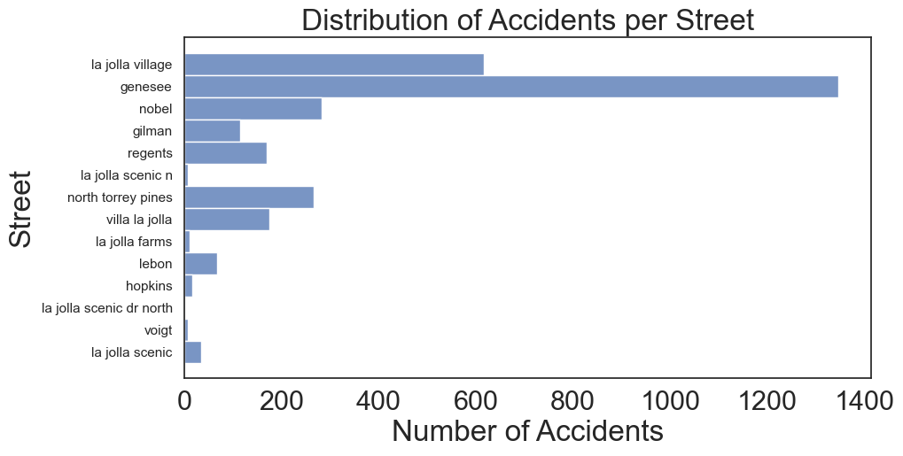
    


The graph displays number of collisions per street. Most of the streets have a number below 400. It is worth to notice that la jolla village and genesee street have the number over 600, which may be perceived as outliers. However, this is due to the fact that these two streets are the longer than the other streets, which leads to more observations. Therefore, we do not consider them as outliers for the purposes of our data analysis.

### Dataset 2: `injured` and `killed` in `collision_data` per `quarter`

First, we use ```groupby``` to find the sum and mean number of injured/killed per quarter:


```python
casualties = collision_data.copy()
casualties = casualties.assign(quarter_year=casualties['year'].astype('str')
                               + '_'
                               + casualties['quarter']
                               ).drop(columns=['quarter','year'])
casualties_gb = casualties.groupby('quarter_year').agg({
                'injured':[('injured_sum','sum'),('injured_mean','mean')],
                'killed':[('killed_sum','sum'),('killed_mean','mean')]})
casualties_gb.columns = ['injured_sum','injured_mean','killed_sum','killed_mean']
casualties_gb = casualties_gb.reset_index()
casualties_gb.head()
```


<div>
<style scoped>
    .dataframe tbody tr th:only-of-type {
        vertical-align: middle;
    }

    .dataframe tbody tr th {
        vertical-align: top;
    }

    .dataframe thead th {
        text-align: right;
    }
</style>
<table border="1" class="dataframe">
  <thead>
    <tr style="text-align: right;">
      <th></th>
      <th>quarter_year</th>
      <th>injured_sum</th>
      <th>injured_mean</th>
      <th>killed_sum</th>
      <th>killed_mean</th>
    </tr>
  </thead>
  <tbody>
    <tr>
      <th>0</th>
      <td>2016_Fall</td>
      <td>128</td>
      <td>1.015873</td>
      <td>0</td>
      <td>0.000000</td>
    </tr>
    <tr>
      <th>1</th>
      <td>2016_Summer</td>
      <td>48</td>
      <td>0.857143</td>
      <td>2</td>
      <td>0.035714</td>
    </tr>
    <tr>
      <th>2</th>
      <td>2017_Fall</td>
      <td>128</td>
      <td>0.955224</td>
      <td>2</td>
      <td>0.014925</td>
    </tr>
    <tr>
      <th>3</th>
      <td>2017_Spring</td>
      <td>89</td>
      <td>0.936842</td>
      <td>0</td>
      <td>0.000000</td>
    </tr>
    <tr>
      <th>4</th>
      <td>2017_Summer</td>
      <td>53</td>
      <td>0.602273</td>
      <td>0</td>
      <td>0.000000</td>
    </tr>
  </tbody>
</table>
</div>


Then we draw the distributions of each statistics per quarter:


```python
sns.set(font_scale=1, style="white")
fig, ax = plt.subplots(2, 2, sharex=False, sharey=False)
plt.subplots_adjust(wspace=0.5, hspace=0.5)
fig.suptitle('Distributions of Injured and Killed per Quarter')
sns.histplot(ax=ax[0][0], data=casualties_gb, x='injured_sum')
sns.histplot(ax=ax[0][1], data=casualties_gb, x='killed_sum')
sns.histplot(ax=ax[1][0], data=casualties_gb, x='injured_mean')
sns.histplot(ax=ax[1][1], data=casualties_gb, x='killed_mean');
```


    
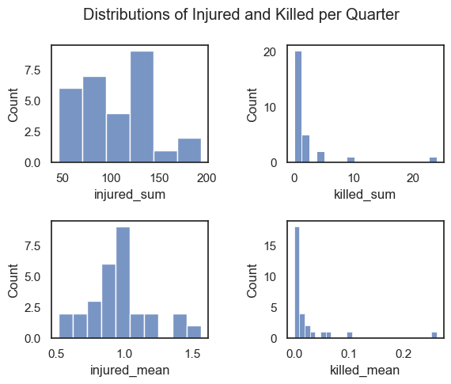
    


We can see that the `injured_sum` per quarter ranges from 50 to 200 across different `quarter`s, and the `injured_mean` per collision per `quarter` is somewhat normally distributed with mean around 1. 

For the `killed_sum` per quarter, we can see that the distribution is very skewed. There are two outliers indicating some large numbers of those killed in collisions within a single `quarter`. And the distribution of the `killed_mean` per collision per `quarter` shows that these two outliers are not because there are many collisions happened in that `quarter`, but due to one (or a few) severe collisions.

## Combined Data Analysis

Now, we will analyze the datasets as a combined dataset in order to understand any potential relationships between them. 

### `count_collisions` vs `percent_occupied` by `quarter` and `year`

We merge the total number of collisions (`count_collisions`) and occupied parking percentage (`percent_occupied`) together into a new dataframe called `parking_collision`.

We first select the relevant columns ('quarter', 'year', 'percent_occupied') from the `parking_data` dataframe. Next, we group the `collision_data` dataframe by `year` and `quarter`, and count the number of incidents resulting in a dataframe named `parking_collision`.
Finally, the code merges the `parking_collision` and `parking_percent` dataframes on `year` and `quarter` using a left join and displays the first few rows of the merged dataframe.


```python
parking_percent = parking_data[['quarter','year','percent_occupied']]
parking_collision = collision_data.groupby(['year','quarter']).count().reset_index().drop(['injured','killed'],axis=1)
parking_collision = parking_collision.rename({'address_road_primary':'count_collisions'},axis=1)
parking_collision = pd.merge(left=parking_collision,right=parking_percent,on=['year','quarter'],how='left')
parking_collision.head()
```


<div>
<style scoped>
    .dataframe tbody tr th:only-of-type {
        vertical-align: middle;
    }

    .dataframe tbody tr th {
        vertical-align: top;
    }

    .dataframe thead th {
        text-align: right;
    }
</style>
<table border="1" class="dataframe">
  <thead>
    <tr style="text-align: right;">
      <th></th>
      <th>year</th>
      <th>quarter</th>
      <th>count_collisions</th>
      <th>percent_occupied</th>
    </tr>
  </thead>
  <tbody>
    <tr>
      <th>0</th>
      <td>2016</td>
      <td>Fall</td>
      <td>126</td>
      <td>81.41</td>
    </tr>
    <tr>
      <th>1</th>
      <td>2016</td>
      <td>Summer</td>
      <td>56</td>
      <td>65.97</td>
    </tr>
    <tr>
      <th>2</th>
      <td>2017</td>
      <td>Fall</td>
      <td>134</td>
      <td>87.16</td>
    </tr>
    <tr>
      <th>3</th>
      <td>2017</td>
      <td>Spring</td>
      <td>95</td>
      <td>83.11</td>
    </tr>
    <tr>
      <th>4</th>
      <td>2017</td>
      <td>Summer</td>
      <td>88</td>
      <td>72.07</td>
    </tr>
  </tbody>
</table>
</div>


```python
sns.scatterplot(data=parking_collision, x='percent_occupied', y='count_collisions',hue='quarter');
```


    
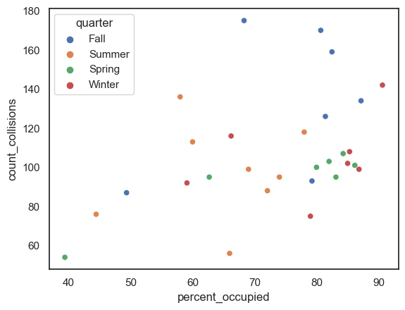
    


The scatterplot uses different colors (hue) to distinguish between different `quarters` ('Fall', 'Summer', etc.). Each point on the scatter plot represents a specific combination of `percent_occupied` and `count_collisions` for a particular `quarter` and `year`.

In this case, it appears that higher `percent_occupied` is associated with more `count_collisions` during different `quarter`s and `year`s.

### `count_collisions` & `percent_occupied` by quarter and year


```python
# Define a function quarter_num to map quarter names to numerical values
def quarter_num(s):
    if s=='Fall': return 4
    if s=='Winter': return 1
    if s=='Spring': return 2
    if s=='Summer': return 3
```


```python
parking_percent = parking_data[['quarter','year','percent_occupied']]

# Group collision_data by year and quarter, count the number of incidents
parking_collision = collision_data.groupby(['year','quarter']).count().reset_index().drop(['injured','killed'],axis=1)
parking_collision = parking_collision.rename({'address_road_primary':'count_collisions'},axis=1)

# Merge the 'df' and 'parking_percent' dataframes on year and quarter using a left join
parking_collision = pd.merge(left=parking_collision,right=parking_percent,on=['year','quarter'],how='left')

# Apply the quarter_num function to map quarter names to numerical values
parking_collision['quarter'] = parking_collision['quarter'].apply(quarter_num)

# Sort the dataframe by year and quarter
parking_collision = parking_collision.sort_values(['year','quarter'])

# Create a new column 'time'
parking_collision['time'] = parking_collision['year'].astype(str) +'_'+ parking_collision['quarter'].astype(str)

parking_collision.head()
```


<div>
<style scoped>
    .dataframe tbody tr th:only-of-type {
        vertical-align: middle;
    }

    .dataframe tbody tr th {
        vertical-align: top;
    }

    .dataframe thead th {
        text-align: right;
    }
</style>
<table border="1" class="dataframe">
  <thead>
    <tr style="text-align: right;">
      <th></th>
      <th>year</th>
      <th>quarter</th>
      <th>count_collisions</th>
      <th>percent_occupied</th>
      <th>time</th>
    </tr>
  </thead>
  <tbody>
    <tr>
      <th>1</th>
      <td>2016</td>
      <td>3</td>
      <td>56</td>
      <td>65.97</td>
      <td>2016_3</td>
    </tr>
    <tr>
      <th>0</th>
      <td>2016</td>
      <td>4</td>
      <td>126</td>
      <td>81.41</td>
      <td>2016_4</td>
    </tr>
    <tr>
      <th>5</th>
      <td>2017</td>
      <td>1</td>
      <td>108</td>
      <td>85.31</td>
      <td>2017_1</td>
    </tr>
    <tr>
      <th>3</th>
      <td>2017</td>
      <td>2</td>
      <td>95</td>
      <td>83.11</td>
      <td>2017_2</td>
    </tr>
    <tr>
      <th>4</th>
      <td>2017</td>
      <td>3</td>
      <td>88</td>
      <td>72.07</td>
      <td>2017_3</td>
    </tr>
  </tbody>
</table>
</div>


```python
plt.xticks(np.arange(-1,31,step=4), np.arange(2016,2024))
sns.lineplot(data=parking_collision[['time','count_collisions','percent_occupied']]);
```


    
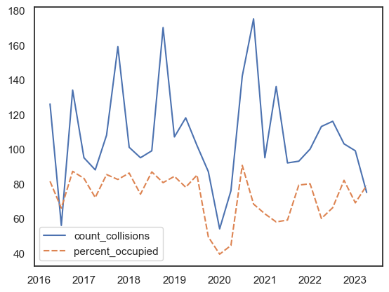
    


The lineplot shows how `count_collisions` and `percent_occupied` changes over time from 2016 to 2023.

From the lineplot, we can generally see that the higher percentage of `percent_occupied`, the more `count_collisions` occur.

We can use linear regression to further explore if `percent_occupied` predicts `count_collisions`.


```python
outcome_1, predictors_1 = patsy.dmatrices('count_collisions ~ percent_occupied', parking_collision)
mod_1 = sm.OLS(outcome_1, predictors_1)
res_1 = mod_1.fit()
print(res_1.summary())
```

                                OLS Regression Results                            
    ==============================================================================
    Dep. Variable:       count_collisions   R-squared:                       0.159
    Model:                            OLS   Adj. R-squared:                  0.128
    Method:                 Least Squares   F-statistic:                     5.094
    Date:                Tue, 12 Dec 2023   Prob (F-statistic):             0.0323
    Time:                        12:33:23   Log-Likelihood:                -136.03
    No. Observations:                  29   AIC:                             276.1
    Df Residuals:                      27   BIC:                             278.8
    Df Model:                           1                                         
    Covariance Type:            nonrobust                                         
    ====================================================================================
                           coef    std err          t      P>|t|      [0.025      0.975]
    ------------------------------------------------------------------------------------
    Intercept           44.7612     28.205      1.587      0.124     -13.111     102.634
    percent_occupied     0.8567      0.380      2.257      0.032       0.078       1.635
    ==============================================================================
    Omnibus:                        6.598   Durbin-Watson:                   1.465
    Prob(Omnibus):                  0.037   Jarque-Bera (JB):                4.954
    Skew:                           0.963   Prob(JB):                       0.0840
    Kurtosis:                       3.625   Cond. No.                         413.
    ==============================================================================
    
    Notes:
    [1] Standard Errors assume that the covariance matrix of the errors is correctly specified.
    


Looking at the coefficients, for every one percent increase in `percent_occupied`, we expect to see about a 0.86 unit increase in the number of `count_collisions`. 
Since the p-value for `percent_occupied` is less than 0.05, `percent_occupied` may be a statisically significant predictor for `count_collisions`.


```python
sns.lmplot(data=parking_collision, x='percent_occupied', y='count_collisions');
```


    
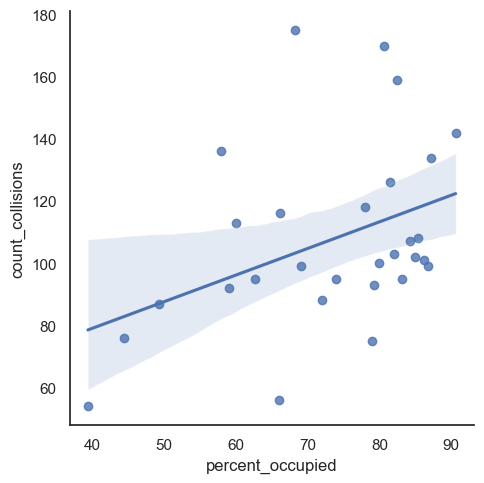
    


The regression line represented by the data indicates there is a slightly positive relationship between parking occupancy levels and the number of collisions.


### `percent_occupied` and `median_collisions` by `quarter` only


```python
parking_percent = parking_data[['quarter','percent_occupied']].groupby('quarter').median()
parking_collision = collision_data.groupby(['year','quarter']).count().reset_index().drop(['year','injured','killed'],axis=1)
parking_collision = parking_collision.groupby('quarter').median().reset_index()
parking_collision = parking_collision.rename({'address_road_primary':'median_collisions'},axis=1)
parking_collision = pd.merge(left=parking_collision,right=parking_percent,on=['quarter'],how='left')
parking_collision
```


<div>
<style scoped>
    .dataframe tbody tr th:only-of-type {
        vertical-align: middle;
    }

    .dataframe tbody tr th {
        vertical-align: top;
    }

    .dataframe thead th {
        text-align: right;
    }
</style>
<table border="1" class="dataframe">
  <thead>
    <tr style="text-align: right;">
      <th></th>
      <th>quarter</th>
      <th>median_collisions</th>
      <th>percent_occupied</th>
    </tr>
  </thead>
  <tbody>
    <tr>
      <th>0</th>
      <td>Fall</td>
      <td>134.0</td>
      <td>80.660</td>
    </tr>
    <tr>
      <th>1</th>
      <td>Spring</td>
      <td>100.0</td>
      <td>82.000</td>
    </tr>
    <tr>
      <th>2</th>
      <td>Summer</td>
      <td>97.0</td>
      <td>67.495</td>
    </tr>
    <tr>
      <th>3</th>
      <td>Winter</td>
      <td>102.0</td>
      <td>85.000</td>
    </tr>
  </tbody>
</table>
</div>


In the barplot below, the data is separated by quarter type for `percent_occupied`. We find that winter quarter at UCSD has the highest parking occupancy rates, while summer quarter has the lowest parking occupancy rates.


```python
sns.barplot(data=parking_collision, x='quarter', y='percent_occupied');
```


    
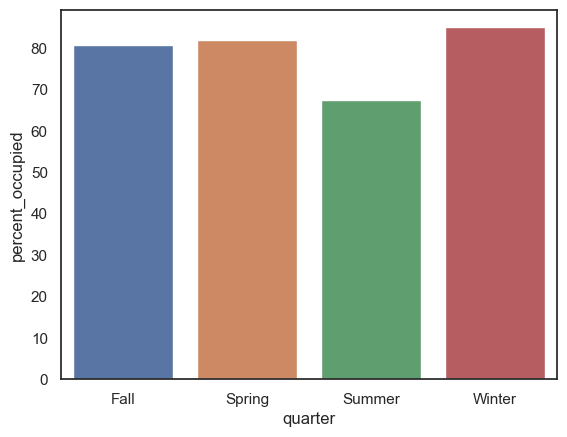
    


In the next barplot below, we take a look at what the median number collisions for each type of quarter are. Fall quarter generally has the most collisions compared to any other quarter. We can hypothesize that this is due to fall quarter being the start of UCSD's academic year, where increased activities on campus would lead to more cars to be on nearby roads and be prone to collisions. For example, a potential reasoning for the increased fall quarter collisions is that first-year students (including transfers) are moving into dorms on campus for the first time. With this being the case, there may be more parents driving to campus and making sure their children have everything they need for the academic year, which is an event that may not be occurring in the other quarter types. First-year students who commute may also attend their in-person classes more regularly during their first quarter in fall. Their attendance to in-person classes may change in subsequent quarters as they form their academic lifestyle and adjust habits to meet their needs, such as relying on podcasted or remote lectures instead of commuting to campus for in-person classes.


```python
sns.barplot(data=parking_collision, x='quarter', y='median_collisions');
```


    
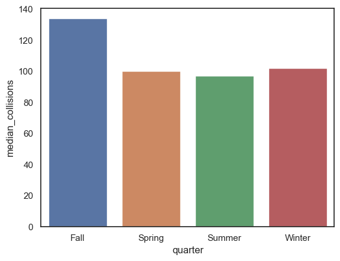
    


To determine if there is a significant relationship between `percent_occupied` and `median_collisions`, we will conduct a t-test. First, we must determine what kind of t-test is appropriate for our data. To do this, we will look at their variance. 


```python
print(np.var(parking_collision['percent_occupied']))
print(np.var(parking_collision['median_collisions']))
```

    44.98552968749998
    224.1875
    

Because the variance of `percent_occupied` is less than `median_collisions` by a factor of greater than 4, we will utilize a Welch's t-test.


```python
stats.ttest_ind(parking_collision['percent_occupied'], parking_collision['median_collisions'], equal_var= False)
```


    Ttest_indResult(statistic=-3.110255203895711, pvalue=0.03403808035237772)


The Welch's t-test returns a p-value of 0.034, which suggests that the relationship between `percent_occupied` and `median_collisions` is statistically significant. 

### `median_collisions` and `percent_occupied` by `quarter`

Similar to the previous barplot, this scatterplot shows that fall quarter has the most collisions compared to the other quarter types, even though parking occupancy is not as high as winter quarter. Since summer quarter is an optional academic quarter, it makes sense that parking occupancy at UCSD is lower compared to the other quarter types. However, summer quarter maintains a similar amount of collisions, which may tell us that collisions may not necessarily be directly tied to traffic with a destination to UCSD.


```python
sns.scatterplot(data=parking_collision, x='median_collisions', y='percent_occupied', hue='quarter');
```


    
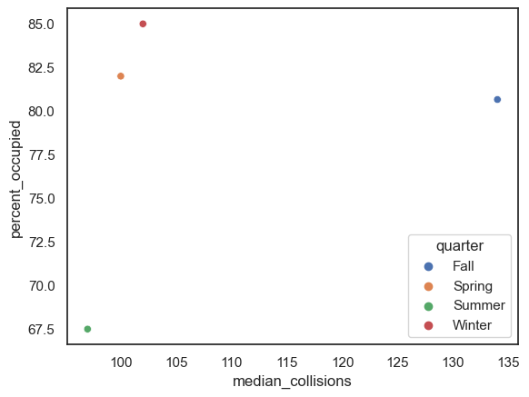
    


### `median_collisions` by `year` only

We use `median_collisions` in the barplot below to visualize the median number of collisions per year, which means that there are 100-115 collisons per quarter for a given year. We can see that in the year 2020, there was a large dropoff in the number of collisions, which could possibly be attributed to less cars on the road during the peak of the COVID-19 pandemic.


```python
parking_percent = parking_data[['year','percent_occupied']].groupby('year').median()
parking_collision = collision_data.groupby(['year','quarter']).count().reset_index().drop(['quarter','injured','killed'],axis=1)
parking_collision = parking_collision.groupby('year').median().reset_index()
parking_collision = parking_collision.rename({'address_road_primary':'median_collisions'},axis=1)
parking_collision = pd.merge(left=parking_collision,right=parking_percent,on=['year'],how='left')
parking_collision
```


<div>
<style scoped>
    .dataframe tbody tr th:only-of-type {
        vertical-align: middle;
    }

    .dataframe tbody tr th {
        vertical-align: top;
    }

    .dataframe thead th {
        text-align: right;
    }
</style>
<table border="1" class="dataframe">
  <thead>
    <tr style="text-align: right;">
      <th></th>
      <th>year</th>
      <th>median_collisions</th>
      <th>percent_occupied</th>
    </tr>
  </thead>
  <tbody>
    <tr>
      <th>0</th>
      <td>2016</td>
      <td>91.0</td>
      <td>73.690</td>
    </tr>
    <tr>
      <th>1</th>
      <td>2017</td>
      <td>101.5</td>
      <td>84.210</td>
    </tr>
    <tr>
      <th>2</th>
      <td>2018</td>
      <td>100.0</td>
      <td>84.315</td>
    </tr>
    <tr>
      <th>3</th>
      <td>2019</td>
      <td>112.5</td>
      <td>82.465</td>
    </tr>
    <tr>
      <th>4</th>
      <td>2020</td>
      <td>81.5</td>
      <td>46.905</td>
    </tr>
    <tr>
      <th>5</th>
      <td>2021</td>
      <td>115.5</td>
      <td>60.890</td>
    </tr>
    <tr>
      <th>6</th>
      <td>2022</td>
      <td>106.5</td>
      <td>72.730</td>
    </tr>
    <tr>
      <th>7</th>
      <td>2023</td>
      <td>99.0</td>
      <td>79.000</td>
    </tr>
  </tbody>
</table>
</div>


```python
sns.barplot(data=parking_collision, x='year', y='median_collisions');
```


    
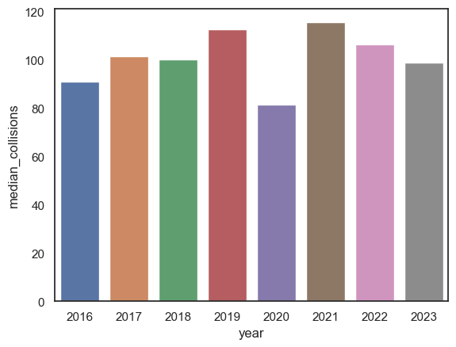
    


# Ethics & Privacy

Our project involved the analysis of data related to parking occupancy on the UCSD campus and traffic incidents on nearby major roads. As we conducted our analysis, we were aware of the importance of ethical standards and privacy concerns. [Deon’s ethics checklist](https://deon.drivendata.org/#data-science-ethics-checklist) provided a useful framework for investigating potential ethics or privacy issues. 

In order to avoid potential bias within our datasets, we only utilized datasets that are public domain and published by reputable sources. For instance, our dataset providing accident information is published by the San Diego government, and our proposed dataset with UCSD parking data is published by UCSD campus authorities. The traffic incident information is not directly collected from individuals, but instead published to public domain at the time of the accident when collected. We acknowledge that some information available in the dataset may be sensitive, though not personally identifying information (PII), and we are excluding this information from our analysis. The parking occupancy data is collected by [“cameras embedded with artificial intelligence”](https://today.ucsd.edu/story/parking-on-campus-theres-an-app-for-that#:~:text=IT%20Services%20enlisted%20student%20developers,which%20parking%20spaces%20are%20available). The parking occupancy data does not collect PII, and no PII information is published with the dataset. 

We acknowledge that there may be unintended consequences as a result of our data analysis. While inferences may be extracted from our conclusions, our data analysis does not aim to make a generalization about the safety of the roads surrounding UCSD. Our analysis intends to be informative about one facet that may contribute to road safety. Correlation does not elude causation, thus, we are simply exploring potential correlation between our datasets. Furthermore, confounds may be present within our data analysis. Relationships between holidays/events and parking/collisions may be present, which could influence our data analysis. Since the data from our first dataset is grouped by each academic quarter of UCSD, there may be outlier data points that we cannot account for because the data has been generalized to a period of roughly three months, and we cannot see any variations that month-to-month events might present. Lastly, our intent is not to influence drivers to shift their driving habits, but instead, to provide insight into potential relationships between driving habits. 

While completing our data analysis, we encountered the need to explore the data regarding the number of individuals injured and killed within our traffic collision dataset. In order to protect the privacy of the individuals involved, we did not include any information regarding where the accidents occurred or when they occurred. Furthermore, we discussed whether or not it was necessary to include a trigger warning for these pieces of our analysis. Because this data is publicly available and injuries are common within traffic collisions, we concluded that this was not necessary. 

We aimed to be transparent in our methodology, and provided an in-depth summary and details of the steps we completed in our analysis, in addition to an overview of the concerns that arose throughout our process. Our project mantains the primary goal of contributing positively to public safety and traffic efficiency information while minimizing any potential harm.

# Discussion and Conclusion

Previous research has often attempted to encapsulate the relationship between traffic incidents and a geographical area. Our analysis attempts to make this relevant to our student population, while still contributing useful information to the broader topic. We wanted to obtain more information on how parking occupancy impacts the frequency of collisions surrounding a college campus, and our analysis succeeded in this aspect. 

The first objective in our data analysis was to explore our datasets. We intended to gain a better understanding of the data. We explored many of the variables available to us in the datasets. Initially, we thought that it may be useful to study both the specific streets and the number of individuals injured/killed in each traffic collision. However, after further analysis, we concluded that this was a broader topic for an analysis separate from our research question. 

The visualizations we created helped us to better understand the data. For example, we were able to see that the number of collisions per quarter was relatively normally distributed, with a slight left skew within a histogram of `collision_data`. We were also able to observe the change in `percent_occupied` using a barplot (e.g. a significant dip in `Spring 2020` on the graph can better display the decrease and increase on the trend than just a single `minimum value`).

In addition to better understanding the data, we were able to identify potential relationships between the datasets which could be a guidance to our hypothesis. In the scatterplot of `percent_occupied` and `count_collisions`, we can see that higher `percent_occupied` is associated with more `count_collisions` during different `quarter`s and `year`s. The lineplot of `percent_occupied` and `count_collisions` by time shows the same trend. This is consistent with our hypothesis that there is a positive correlation between the number of cars parked on campus (`percent_occupied`) and the amount of collisions (`collision_data`) occurring on and around the UCSD campus.

After combining our datasets into a single dataframe, we conducted statistical analyses to get a deeper grasp of the relationship between our two variables, parking occupancy percentage (`percent_occupied`) and number of collisions (`collision_count`). First, we used linear regression, which told us that for every one percent increase in `percent_occupied`, we expect to see about a 0.86 unit increase in the number of `count_collisions`. The p-value of 0.032 meant that `percent_occupied` is a statisically significant predictor for `count_collisions` at a significance level of 0.05. When plotting the line of regression, we see a slightly positive relationship between the two variables. To verify the relationship between the two variables, we used a Welch's t-test, which returned a p-value of 0.034, which also suggests there is statistically significant relationship between `percent_occupied` and `count_collisions`.

We acknowledge that our project faced some limitations. First, the scope of our research was confined to the major roads around the campus, as there was no public dataset available for the smaller roads within the campus. And some of these major roads, such as Genesee Avenue, include very long stretches that are not necessarily near UCSD, potentially affecting the representativeness of our findings in relation to campus parking. Another significant constraint was our reliance on reported collisions. Since not all collisions are reported to the police, our data are likely underestimating the actual number of collisions. Moreover, while we acknowledged the impact of COVID-19 on traffic patterns, our analysis did not dive into quantifying this effect precisely. Lastly, an aspect that remained outside the scope of our study was examining how access to public transportation influences the number of collisions.

In conclusion, our investigation into the dynamics between parking occupancy and the incidence of traffic collisions near a college campus provides new insights into urban planning and safety in academic settings. Despite initial hypotheses favoring more granular data such as street-specific incidents or the severity of collisions, our refined focus on parking occupancy has yielded significant findings. Our statistical analysis revealed a modest yet statistically significant positive correlation between parking occupancy rates and the number of collisions, with a higher percentage of occupied spaces slightly increasing the likelihood of traffic incidents. This relationship held under rigorous scrutiny, including linear regression and Welch's t-test, both indicating the influence of parking occupancy on collision frequency. These results underscore the importance of considering parking management as a factor in traffic safety strategies, especially in areas with high pedestrian and vehicle convergence such as university campuses. Our study not only augments the academic dialogue on traffic and urban studies but also provides actionable data that can inform policy and campus safety initiatives.


# Team Contributions

We identified a topic, dataset(s), and research question as a team. Each member of our team contributed to the writing portions of our analysis. Additionally, each member participated in the development of our slide presentation and spoke within the presentation. We worked together to resolve any difficulties that arose throughout the analysis process. 

- Haoyu Fu: Web scraping the datasets, making EDA and Analysis graphs, writing limitations of the discussion section
- Qianxia Hui: Contributed to overview, background, EDA and combined data analysis, and conclusion sections
- Arianna Morris: EDA and visualization graph(s), Combined Data Analysis (Welch’s T-Test), Ethics and Privacy section
- Michael Tang:  Contributed to the background, EDA analysis, combined data analysis (linear regression), and discussion sections
- Bofu Zou: Contributed to data wrangling and data cleaning, background, and relevant visualization in discussion
